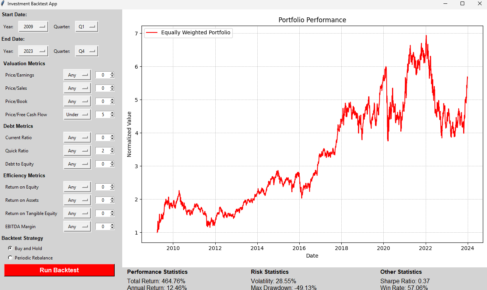

# InvestmentApp

A desktop app for screening S&P 500 stocks on fundamentals and backtesting portfolio strategies against real historical prices.

Pick a quarter, filter the index down with valuation/debt/efficiency criteria, choose a strategy, and see how that basket would have performed — equity curve plus six performance and risk statistics.

## Features

- **Fundamental screening** across 11 metrics grouped into three categories (valuation, debt, efficiency), each filterable as Any / Over / Under a threshold.
- **Quarterly date range** — pick a start and end year + quarter; screening happens on the start quarter's fundamentals.
- **Pluggable strategies** — Buy and Hold and Periodic Rebalance ship in the box, registered through a decorator so adding more is a single file.
- **Six statistics** — total return, annualized return, volatility, max drawdown, Sharpe ratio, and monthly win rate.
- **Embedded equity curve** rendered with matplotlib inside the Tkinter window.
- **Non-blocking backtests** — downloads and simulation run on a background thread, so the UI stays responsive.



## Installation

Requires **Python 3.10+** (developed and tested on 3.13).

```bash
git clone https://github.com/alestoman5/InvestmentApp-main.git
cd InvestmentApp-main
pip install -r requirements.txt
```

You also need the fundamentals dataset, which is not bundled — see [Data](#data) below.

Tkinter ships with CPython on Windows and macOS. On Debian/Ubuntu you may need it separately:

```bash
sudo apt install python3-tk
```

## Usage

```bash
python main.py
```

Then:

1. Choose a **start** and **end** year/quarter in the left panel. Only years the dataset actually covers are offered.
2. Set any **metric filters** — leave a metric on *Any* to ignore it, or pick *Over* / *Under* and a threshold.
3. Select a **strategy**.
4. Click **Run**.

Tickers that pass the screen on the start quarter are downloaded from Yahoo Finance for the full period, the strategy is simulated over them, and the chart plus statistics update in place.

## Data

Two sources, neither requiring an API key:

| Source | Used for | Included? |
| --- | --- | --- |
| `snp500.csv` | Quarterly fundamentals used by the screener | **No — you supply it** |
| [yfinance](https://github.com/ranaroussi/yfinance) | Daily closing prices, fetched live at backtest time | Yes, fetched at runtime |

### Getting `snp500.csv`

The fundamentals dataset is **not redistributed here**, because it is third-party data whose licensing terms are not mine to grant. Generate it yourself from the Kaggle notebook it was originally compiled from:

> [S&P 500 Fundamental Data Model](https://www.kaggle.com/code/vladosht/s-p-500-fundamental-data-model) by *vladosht*

Save the result as `snp500.csv` in the repository root. The app will tell you where it expects the file if it is missing.

### Expected format

One row per ticker per quarter, with these columns:

```
year, ticker, pe, ps, pb, pfcf, current_ratio, quick_ratio,
debt_to_equity, roe, roa, rote, ebitda_margin, quarter
```

`quarter` is the period key the screener matches on (`2009Q1`) and is what drives the year dropdowns; `year` is, despite its name, the period **end date** (`2009-03-31`). Not every metric is populated for every row. The original dataset covers 2009 Q1 – 2023 Q2 across roughly 25,000 rows.

Any other source works too — implement `DataProviderBase` (`utils/data_provider.py`) against a database or API and pass it to `StockScreener` in `main.py`; the CSV reader is just one implementation.

Price data is cached in memory per `(ticker, start, end)` for the lifetime of the process, so re-running the same period is fast.

## Architecture

| Package | Responsibility |
| --- | --- |
| `app/` | Tkinter GUI, widgets, input collection, controller, and the threaded backtest orchestrator |
| `data/` | yfinance download, response normalization, and the in-memory price cache |
| `strategies/` | Strategy base class and registry, concrete strategies, statistics, plotting |
| `utils/` | Configuration constants, the CSV data provider, and the stock screener |

`main.py` wires the pieces together explicitly — CSV provider → screener → GUI — so each layer can be swapped or tested independently. `DataProviderBase` in `utils/data_provider.py` is an abstract interface, so the CSV backing store can be replaced with a database or API without touching the screener.

## Adding a strategy

Subclass `StrategyBase`, implement `simulate()` to populate `self.portfolio_series`, and register it with a display name. The base class handles price fetching, statistics, and plotting for you.

```python
# strategies/my_strategy.py
from __future__ import annotations

import pandas as pd

from .strategy_abstract import StrategyBase
from .registry import register_strategy


@register_strategy("My Strategy")
class MyStrategy(StrategyBase):
    """One-line description shown nowhere, but be kind to future readers."""

    def simulate(self) -> None:
        # self._price_data is a DataFrame of closing prices, one column per ticker.
        cols = [t for t in self._tickers if t in self._price_data.columns]
        prices = self._price_data[cols].dropna(axis=1, how="all")
        if prices.empty:
            self.portfolio_series = pd.Series(dtype=float)
            return

        self.portfolio_series = (prices / prices.iloc[0]).mean(axis=1)
```

Then import it in `strategies/__init__.py` so the decorator runs at startup:

```python
from .my_strategy import MyStrategy
```

It will appear automatically in the strategy selector. See `strategies/buy_and_hold.py` for the reference implementation.

## Limitations

- **Requires pandas ≥ 2.2** — the `"ME"` resample alias used for the monthly win rate does not exist in earlier versions.
- **Screening is point-in-time on the start quarter only.** The basket is fixed at the start date; it is not re-screened as the backtest progresses.
- **The reference dataset carries survivorship bias** — it reflects index membership as compiled, not as it stood in each historical quarter.
- **No transaction costs, slippage, taxes, or dividends** are modelled. Returns are price-only.
- **The Sharpe ratio assumes a flat 2% risk-free rate**, hardcoded in `strategies/stats_calculator.py`.
- **No test suite yet.** `StockScreener.filter_stocks` and `StatsCalculator.calculate` are both pure functions and would be the natural place to start.

## Disclaimer

This project is for **educational and research purposes only**. It is not financial advice, not a recommendation to buy or sell any security, and makes no guarantee of the accuracy of its data or calculations. Backtested results are hypothetical and do not predict future returns. The screening dataset also carries survivorship and point-in-time biases that are not corrected for. Do your own research.

## License

Source code: [MIT](LICENSE).

No third-party data is redistributed in this repository — the fundamentals dataset is obtained separately by the user under its own terms. See [Data](#data).
